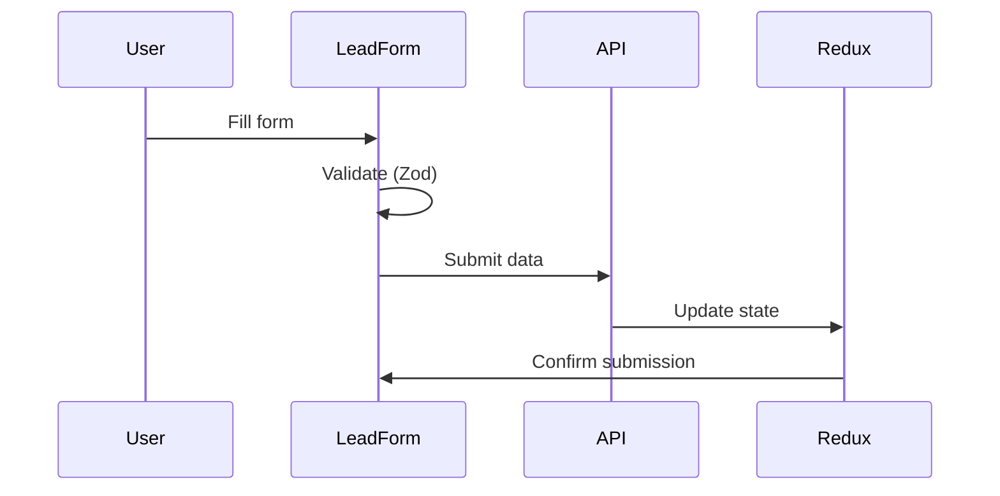
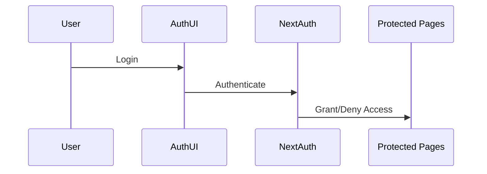

# System Architecture Documentation

## Overview

This document outlines the architectural design of the Alma Assessment Frontend application, a modern web application built with Next.js and related technologies.

## Tech Stack

### Core Technologies

- **Next.js**: Server-side rendering and routing framework
- **TypeScript**: Static typing and enhanced development experience
- **Tailwind CSS**: Utility-first CSS framework
- **Shadcn UI**: React components built on Radix UI
- **Redux Toolkit**: State management
- **NextAuth.js**: Authentication system
- **React Hook Form**: Form handling
- **Zod**: Schema validation

## System Architecture

### 1. Application Layers

#### Frontend Layer

- **Pages**: Server and client components under `app/`
- **Components**: Reusable UI components under `components/`
- **Hooks**: Custom React hooks under `hooks/`
- **Types**: TypeScript type definitions under `types/`
- **Redux Store**: Global state management under `redux/`

#### API Layer

- **Authentication API**: NextAuth.js integration
- **Lead Management API**: RESTful endpoints for lead operations
- **Form Processing**: Server-side validation and data handling

### 2. Component Structure

```
app/ (Next.js App Router)
├── layout.tsx (Root layout)
├── page.tsx (Home page)
├── api/ (API Routes)
│   ├── auth/ (Authentication endpoints)
│   └── lead/ (Lead management endpoints)
├── assessment/ (Assessment feature)
└── dashboard/ (Admin dashboard)
    └── leads/ (Lead management interface)

components/ (Reusable Components)
├── auth/ (Authentication components)
├── dashboard/ (Dashboard-specific components)
├── forms/ (Form components)
└── ui/ (Base UI components)
```

### 3. Data Flow

1. **Authentication Flow**

   - User authentication through NextAuth.js
   - Session management and protected routes
   - Auth state maintained in Redux store

2. **Lead Management Flow**

   - Form submission through React Hook Form
   - Data validation using Zod
   - API interaction through Redux actions
   - Server-side processing and storage

3. **State Management**
   - Global state managed by Redux
   - Local state handled by React hooks
   - Server state cached and managed by Redux

## Security

### Authentication

- NextAuth.js for secure authentication
- Protected API routes
- Session-based authentication
- Secure credential handling

### Data Protection

- Form validation on both client and server
- CSRF protection
- Secure file upload handling
- Protected API endpoints

## Component Interactions

### 1. Form Submission Process



### 2. Authentication Flow



## Performance Considerations

1. **Code Splitting**

   - Automatic code splitting by Next.js
   - Dynamic imports for large components
   - Route-based code splitting

2. **Caching Strategy**

   - Static page generation where possible
   - API response caching
   - Redux state persistence

3. **Optimizations**
   - Image optimization with Next.js Image
   - Component lazy loading
   - Tailwind CSS purging

## Deployment Architecture

The application is deployed on Vercel with the following setup:

- Production Environment: [https://alma-fe-assessment.vercel.app/](https://alma-fe-assessment.vercel.app/)
- Edge Network Distribution
- Automatic HTTPS/SSL
- Serverless Functions for API Routes

## Error Handling

1. **Client-Side Errors**

   - Form validation errors
   - API request failures
   - Authentication errors

2. **Server-Side Errors**
   - API endpoint errors
   - Authentication failures
   - File processing errors

## Future Considerations

1. **Scalability**

   - Implementation of caching layer
   - API rate limiting
   - Performance monitoring

2. **Features**
   - Enhanced analytics
   - Real-time updates
   - Advanced search capabilities

## Environment Configuration

Required environment variables:

```env
NEXTAUTH_SECRET=<secret>
NEXTAUTH_URL=<url>
```

## Development Workflow

1. Local Development

   ```bash
   npm run dev
   ```

2. Production Build

   ```bash
   npm run build
   npm run start
   ```

3. Code Quality
   ```bash
   npm run lint
   ```

## Monitoring and Logging

- Error tracking through console logging
- API response monitoring
- Performance metrics tracking

## References

- [Next.js Documentation](https://nextjs.org/docs)
- [NextAuth.js Documentation](https://next-auth.js.org/)
- [Shadcn UI Documentation](https://ui.shadcn.com/docs)
